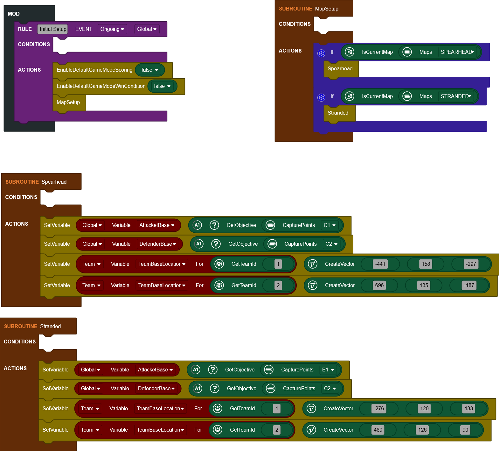



## Intro

What are Subroutines?

They are sections of code you can seporate from the MOD and place anywhere on the screen. You can then use them multiple times throughout your MOD rather than duplicating the code multiple times. Subroutines are a great way to simplify your code and to make it easier to read.

Why use subroutines?

- Helps simplify the code
- Makes your project easier to read
- Easier to make changes
- Reduces the number of blocks for big projects

You can make is easier to read by splitting up the code. For instance if you want to set up a large array, instead of having it mixed with the rest of the code in your rule you can seporate it into a Subroutine

---

## How to create Subroutines

To create a Subroutine go to:

- Subroutines
- Create Subroutine
- Enter a name for the Subroutine (For this example we will use "Spawns")
- Click Create

Once you have done this a new block will appear with the name of your Subroutine in the list, in this example "Spawns". In the editor a subroutine block will be added which you add/move blacks to.

---

## How to use Subroutines

In the example bellow we have a Rule which sets the game score and time. However it also creates an array of coordinates. This is fine but we can use the a subroutine to make it easier to manage and read by moving those setVariable blocks into the new subroutine we have created.

Now we can use the "Spawns" block and add that to the rule which will run the Subroutine and the blocks that we seportated.

By doing this we have now made the Rule easier to read and by seporating all the setVariable blocks for this array it makes it easier to manage.

---

## Linking Subroutines

You can also link multiple subroutines together to make things even easier to manage. In this example we have one for a map detection. Once the map has been detected it will then run the Subroutine for that map.

---

## Subroutines with Parameters

If you have paramters that share the same blocks but with the only difference being values, then you might want to use Parameters to simplify and reduce the number of blocks used.

For example, when setting up icons you will typically need to define the:

- Icon enabled
- Text enabled
- Image
- Owner
- Position
- Text

All of this is just for one world icon, and if we have 5 icons then we are going to have to do this 5 times. However by using a Subroutine with a Parameter we can greatly simplify this. If we create a new Subroutine or right click and edit an existing one we can add some parameters. For this example I have named mine "IconSetup".

For this one we are going to just do the:

- Icon
- Image
- Position
- Text

The Enabled/Owner will be the same in this example so we will not change these.

**OPTIONAL:** You can also set the type of data. By default "Any" will allow you to put in anything.

On the left panel, you will see a block called GetSubroutineArgument which will let us use the Parameters we hase defined.

We will now move the Icon blocks into our Subroutine and then replace the fields we wish to control with the GetSubroutineArgument and set it to the suitable Parameter.

One we have done this you can now add in the new "IconSetup" block which will have slots for each of the parameters.

Now we can add this in and fill in our slots with the unique data for your icon. Let's do the same for all 5 of them. It should look like this:

After this is done you will have a much simpler and eaiser to read code compared to having to have 5 copies of the blocks.

