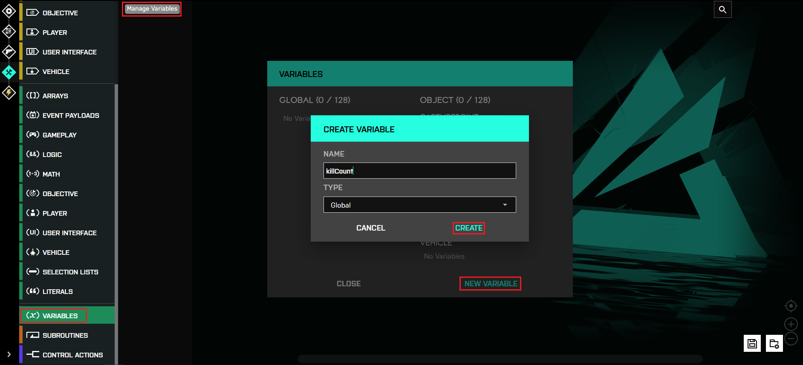
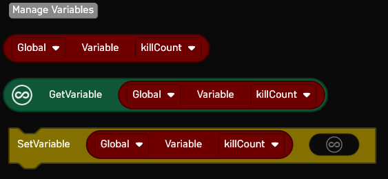
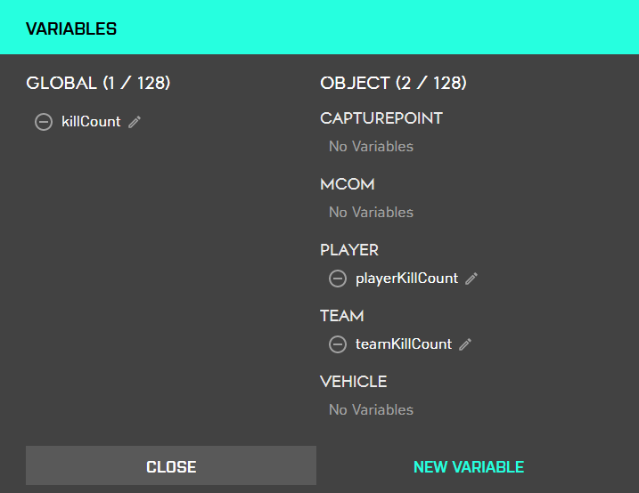



## Intro

If you are new to varibales then lets answer the first question. What is a variable?

A variable is anything you want it to be.

For example they can be a number, text, weapon, player, list of players/spawn points/objectives.

Essentially you use a variable to store information so you can use it later in your code.

Let's start off with a basic example.

---

## Basic Example

We are going to create a variable and use it to store a number to track how many kills there have been for the entire match.

First, create a variable

- Click on Variables
- Manage variables
- New variable
- Name it something meaningfull, in this case "killCount"
- Leave it as a Global variable
- Click Create

You have now created a variable. Now we just need to use it to count kills.

You should see some new blocks in the Variables section.

The 2 we are interested in is the GetVariable and SetVariable:

- GetVariable - Will use the variable
- SetVariable - Allow us to set what this variable is

To use these, we will create a rule which triggers when a player earns a kill.

- Create a new rule OnPlayerEarnsKill
- Add SetVariable for the killCount
- Using the Add block we can get the current GetVariable for killCount and add 1
- Now every time a player earns a kill it adds 1 to the killCount variable

By default if a variable is not defined it will be "0" which means when we start the game it will be at 0 and will add 1 for every kill.

---

## Variable Types

Now that we have a basic understanding on how to use a variable, we have different types of variables.

- Global - This is a single variable shared globally
- Player - This will be unique for every player such as their individual kill count or score
- Team - This will be a variable for each team
- Vehicle - You can assign variables to vehicles
- CapturePoint - Each capture point/flag can also have variables
- MCOM - Each MCOM can have a variable

As an example below, we can use the kill count to show how we could use these.

- Using the Global variable will add to the total kills for the match.
- Using the Player variable and using the EventPlayer will only add it to their total kills.
- By using the Team variable we can also count it towards the total kills for the EventPlayers team.

