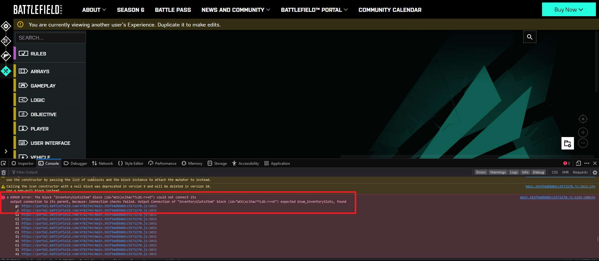
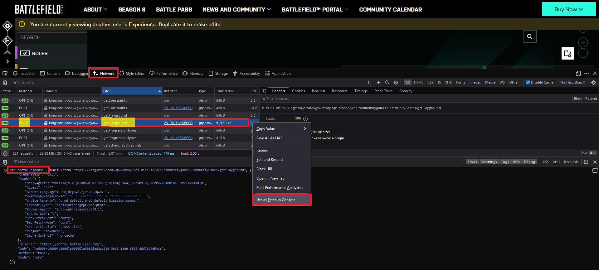

Sometimes there might be issues in loading your rules (especially when using more complex and exported data for import).

In this section we will show you how to debug issues while on PC and using your internet browser.



# Debug Loading Issues

## Preparation

The first step to check possible errors in the background is opening your browser console.  
The browser console is usually part of the browsers "Developer Tools" which usually can be opened by pressing `F12`.

In order to have all the necessary information available, we will navigate to the Core settings of the experience first.  
Within the Core settings section we open the developer tools of the browser and navigate to the console.


You can ignore the red warning for now, but should definitely keep it in mind.

Now, beside the console we are also interested in the network traffic for debugging. Therefore we switch to the "network" tab and

- disable cache
- enable "Persist Logs"
- Clear all entries in the network tab log
- Clear all entries in the console tab log


## Examine Console Logs

Once the preparation is done, we navigate to the rules editor section in the portal builder.  
A lot of new requests will appear in the network tab and also in the console tab of the developer tools.

First, checkout the console tab and scroll through the new entries.  
Are there any red errors or interesting warnings? If so, they might already give you a hint or tell you what's wrong.



In thise case it seems that a block has an issue regarding it's type and we need to look in the data loaded in the background.  
If there are issues with the underlying data (blocks), we can examine these by using the network tab.

## Examine Network Logs


In some cases it might also be helpful to navigate to the desired page with the network tab open, then clear the entries and do a reload of the page, to have all relevant requests at hand.


In the network requests search for requests with the resource/file `getPlayground` and the method `POST`.  
Right click on that entry and select "Use as Fetch in Console". This will open the console and pre-fill it with a command to request the data again.  
Before hitting enter/return on that command, prepend the beginning with the following:  
`var portalResponse =`  
So that it will look like this:  
`var portalResponse = await fetch(...`  
Now completely remove the line within the `headers` section containing `"Pragma": "no-cache",`

Position your cursor at the end of the statement and press enter/return to send the command.



Once the command finished successfully, put your cursor to the command line input again and enter the following commands (either as whole block or one by one):

```javascript
// var portalResponse = await fetch(...
var portalResponseContent = await portalResponse.text();
var findBlocksRegExp = new RegExp('{"mod":{.*}');
JSON.parse(portalResponseContent.match(findBlocksRegExp)[0]);
```

Put your cursor at the end of the commands again and press enter/return to send the commands.  
As a result you will get an object printed in the console. Right click on the object entry in the console and select "Copy Object".
Open a text editor of your choice and paste the copied object to it.
You now have the JSON representation of your visual blocks and can check the details of them.


In our example the error message was related to a block-ID, which we can now find with the usual search functionality within a text-editor and examine it further.

# Debug Saving Issues


Work in progress... check back later!

